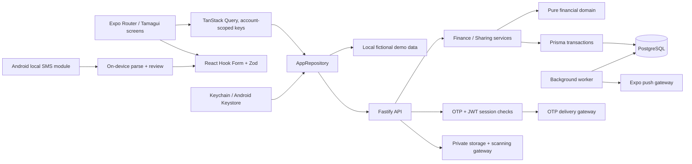
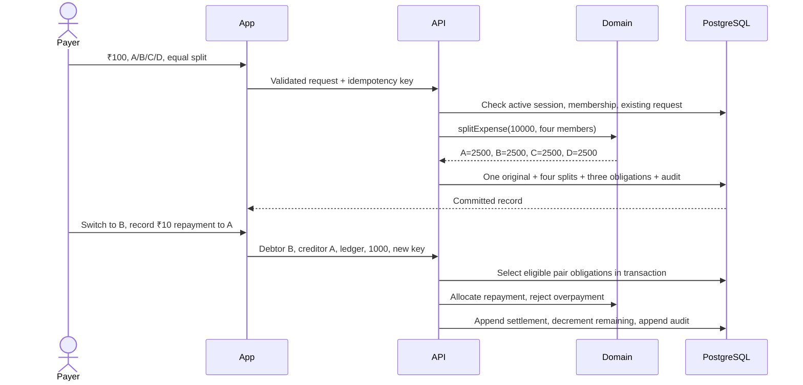
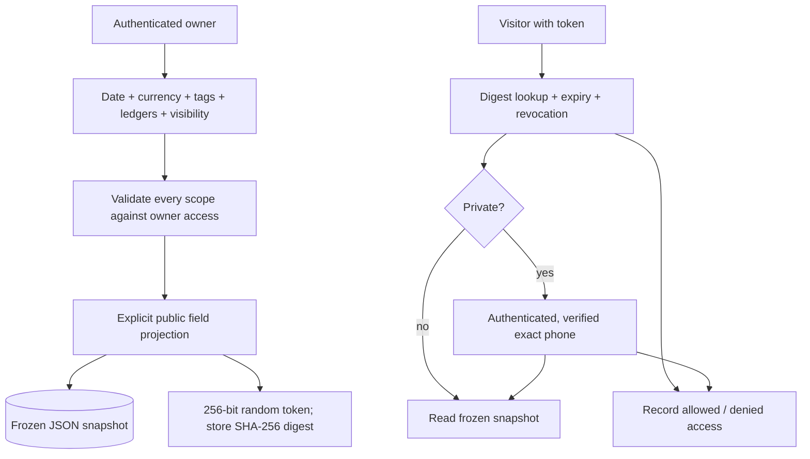

# SettleUp architecture and product decisions

This repository contains a working Expo/React Native application and a PostgreSQL-backed Fastify API. The browser demo is for fictional data; native API mode uses verified phone sessions. It is a release candidate foundation, not a claim of completed app-store certification or an independent security audit.

## Scope and assumptions

- Personal accounts identify people, not banks. Adding an account saves a separate device session; switching clears query state. Shared ledgers deliberately expose their shared entries to current members, without exposing other personal records.
- INR is the initial default. Supported ISO currencies retain their own minor-unit precision; balances never net across currencies. There is no exchange-rate conversion.
- The logged-in account is the author/payer. A client cannot claim another user's identity. Only a debtor records a repayment; the creditor can dispute it. SettleUp does not transfer funds or verify bank settlement.
- A posted expense is a durable original record. Reversal records and audit events preserve corrections. Tags, profile settings, and goals are mutable metadata; changes to posted money are not.
- Equal splits give leftover minor units to participants in stable input order. Percentage values use integer basis points, with largest-remainder reconciliation. Shared spending means the account's own allocated share, not the full amount it paid.
- An `ADJUSTMENT` created from the manual "Money in" or reviewed credit flow represents personal incoming money. It never silently repays an obligation. Corrections to expenses use reversal plus replacement.
- Phone contacts are selected individually. A selected number resolves to an existing user or creates an unverified member identity. Verification later claims that same identity; no messages are sent automatically.
- Demo accounts intentionally use separate fixture copies. They are not a simulation of a synchronized multiplayer backend. API mode is the authority for cross-device activity, concurrency, secure links, and session revocation.
- Following the request to keep the schema lean, models contain only fields with a concrete use. Join tables use composite primary keys; monetary and expiring resources have the relevant checks and indexes. There are no speculative generic utility layers.

## Repository layout

```text
apps/
  mobile/
    app/                 Expo Router routes
    src/
      components/        reusable controls, icons, Pip mascot, adaptive shell
      features/          overview, transactions, imports, account, planning
      data/              repository, account sessions, query hooks
      services/device.ts camera-adjacent device integrations and SMS provider
      theme/config.ts    Tamagui fonts, themes, palette
    modules/transaction-sms/ local Kotlin Expo module (Android only)
  api/src/
    auth/                OTP providers, session issuance and rotation
    finance/             expense, obligation, settlement, dispute services
    sharing/             scoped immutable analytics snapshots
    infra/               Prisma boundary and audit writes
    app.ts               HTTP validation, metadata CRUD, authorization boundary
    worker.ts            expiry cleanup, recurring goals, notification outbox
packages/
  contracts/src/         Zod request schemas and response types
  domain/src/            pure money/split/import/date logic, analytics, fixtures
prisma/                  schema, migration with checks, idempotent seed
scripts/                 isolated local PostgreSQL launcher
 tests/                  domain, API integration, browser journeys
```

The domain package has no HTTP, React, Prisma, or token-storage dependency. `AppRepository` switches between a demo adapter and a typed API adapter. The backend `DashboardRepository` interface isolates read projections from the UI. Financial mutations run in serializable Prisma transactions and retry serialization conflicts. Query authorization and service authorization both reject inaccessible resources. Request schemas validate inputs; all allocations and balances are recalculated on the server.

## System diagram



## Shared expense and repayment



## Sharing data flow



## Entity relationships

- `User` has one profile and verified phone identity and many device sessions. Session families make rotation replay revoke descendants. OTP challenges are separate, temporary HMAC-protected records.
- `ContactPeer` is owned by one account and may optionally link to a verified user. The invitation token digest and expiration are removed after a successful claim. Blocks are directional user pairs.
- `Group` owns ledgers and group membership. Each `Ledger` has a currency, active/archived state, members with owner/admin/member roles, activity, and transactions.
- `Transaction` is the original business event. `TransactionParticipant` records involvement, while `ExpenseSplit` holds exact per-user allocations and the input method/weight. The composite keys prevent duplicate allocations.
- `Obligation` references that original transaction and a distinct debtor/creditor pair. `Settlement` connects a new repayment transaction to each obligation it reduces. History survives when `remainingMinor` changes. Advisory simplification never replaces these rows.
- A transaction's `correctsId` references the original reversed entry. A unique partial index prevents multiple reversals. Disputes remember the prior status and who opened/resolved them. A second partial index permits one open dispute per transaction.
- `Tag` belongs to an account and joins transactions through `TransactionTag`. Multiple tags can overlap in analytics; category totals are explicitly labeled as overlapping.
- `Goal` holds a limit, recurrence, dates and thresholds. `GoalScope` selects a tag or ledger. Its check constraint requires exactly one selector per row.
- `SmsImportRecord` stores only an account-scoped fingerprint, review decision and expiry. Raw messages are not part of the server schema. Native review also retains salted fingerprints locally.
- `SharedAnalyticsLink` owns one frozen snapshot and access events. Private-phone bindings and internal IDs never appear in public snapshot projections.
- Notification preferences and an idempotent outbox are separate from ledger records.
- `AuditEvent` retains the actor, resource, action, relevant before/after metadata, and time. Financial rows use restrictive foreign keys to prevent cascading destruction of other participants' history.

## Navigation and design

Home, Transactions, Add, Analytics, and Groups form the mobile bottom navigation. Wide screens use a sidebar with Goals and device tools. Detail, authentication, account, sharing, and settings screens are regular Expo Router routes so deep links are reproducible.

The design uses Montserrat, a white canvas, muted violet controls, mint headers and pastel finance action tiles, original wallet artwork, and a geometric mascot called Pip. Controls are at least 44 points. Chart summaries include text. Fonts respect native font scaling. Light and dark themes share semantic roles.

## Operational boundaries

The API dashboard currently returns the account's full accessible dataset for correct local analytics. Before large-scale rollout, move aggregations into indexed SQL and add cursor pagination to activity; never apply a silent result limit to analytics. The initial worker is a single process with a bounded batch and retrying outbox; production scale needs durable distributed scheduling, fair pagination, delivery receipts, and monitored retries. These are explicit release gates, not silently claimed capabilities.

## Bill itemisation and interaction design

`TransactionItem` has just five columns: `transactionId`, `position`, `name`, `quantity`, `amountMinor`. `(transactionId, position)` is the primary key; there is no redundant item UUID, currency, unit price, or timestamp. Currency and date belong to the expense. `amountMinor` is a signed line total including quantity; negative discount lines and positive tax lines reconcile to the expense total. Up to 100 lines are validated and inserted atomically with the parent transaction. Posted lines retain the original audit semantics: reverse and replace to correct them. Item rows do not create additional debts or change the chosen participant split.

The authenticated API sends a selected JPEG/PNG to the configured vision model for one-time structured extraction. Scanning never saves a financial record or bill image. Applying scan results explicitly replaces the editor values; only reviewed item lines are stored when the transaction is created. Shared analytics snapshots continue using their allowlist and do not expose item detail.

Pip has reading, success, help, and wave poses. Feedback is scoped to the active account and clears after 4.5 seconds or on account switch.
